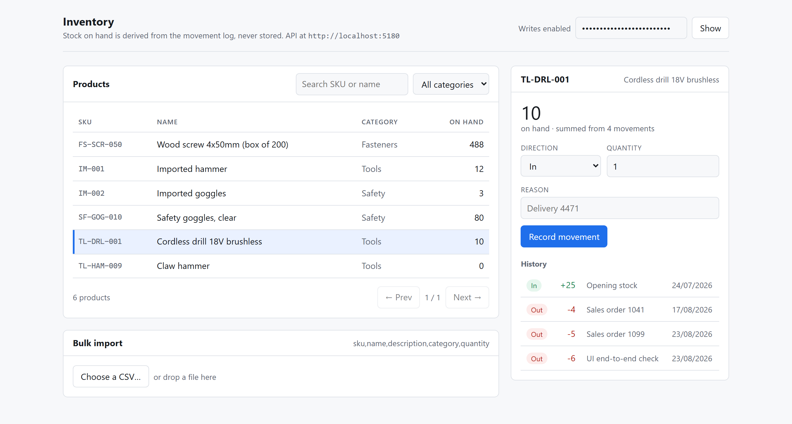
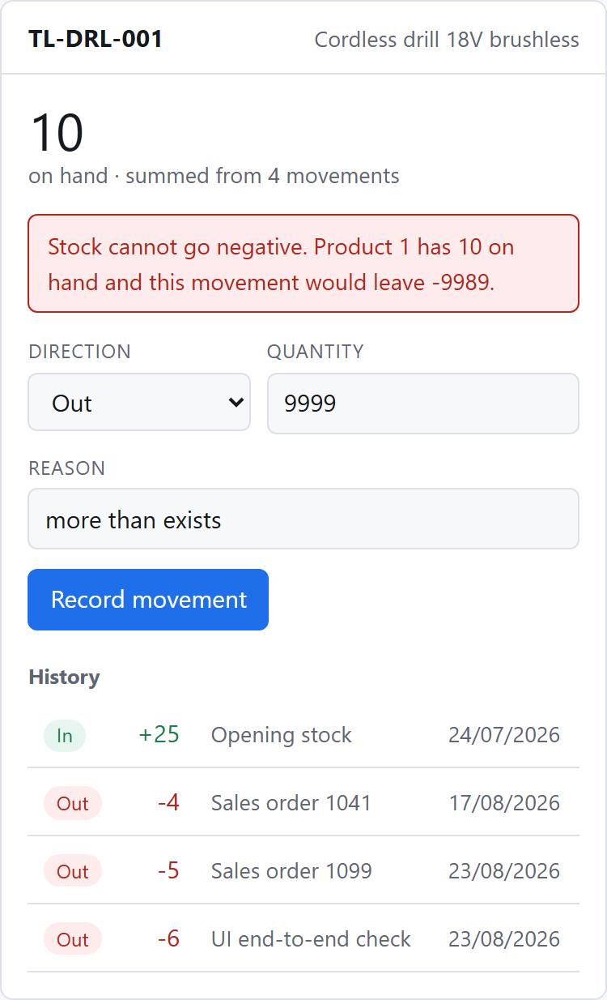

# InventoryManagementSystem

[](https://github.com/Ar4gornn/InventoryManagementSystem/actions/workflows/dotnet.yml)

A .NET 8 REST API for tracking stock. Products, categories, and an append-only movement log.

The design decision everything else follows from: **there is no quantity column.** Stock on hand is
the sum of a product's movements, so the history is the only source of truth and the two can never
drift apart. A mistake is corrected by recording a compensating movement, not by editing the past.

## Stack

| | |
|---|---|
| Runtime | .NET 8 (`net8.0`) |
| Web | ASP.NET Core, attribute-routed controllers, Swagger |
| Data | EF Core 8.0.30 + SQLite, migrations applied on startup |
| UI | React 19 + TypeScript + Vite, in [`web/`](web/) |
| Tests | xUnit — 86 tests: service rules, real SQLite, and the HTTP layer |

## Quickstart

Needs the [.NET 8 SDK](https://dotnet.microsoft.com/download/dotnet/8.0). No database to install.

```bash
git clone https://github.com/Ar4gornn/InventoryManagementSystem.git
cd InventoryManagementSystem
```

The API **will not start without an API key.** There is no default — a fallback in source becomes
the key of every deployment that forgot to set one.

```bash
export Security__ApiKey="pick-any-secret-for-local-use"     # bash
$env:Security__ApiKey = "pick-any-secret-for-local-use"     # PowerShell
```

Then:

```bash
dotnet run --project InventoryManagementSystem
```

Open <http://localhost:5180/swagger>. The database is created, migrated and seeded with three
categories and three products on first run.

Run the tests:

```bash
dotnet test
```

## Try it without installing anything

**<https://ar4gornn.github.io/InventoryManagementSystem/>**

That is the real UI with a stand-in for the API. GitHub Pages serves static files and this
project's API is not hosted anywhere, so rather than publish a page whose every request fails, the
client is swapped at build time for an in-browser copy of the API's rules — see
[`web/src/demo/`](web/src/demo/). Same shapes, same status codes, same refusals. The page says so
in a banner; it does not pretend to be the live API.

Worth doing there, because it is the design rather than the CRUD:

- Select the drill. It reads **21**, and underneath, *"summed from 2 movements"* — a `+25` opening
  and a `-4` sale. There is no quantity column to read it from.
- Record an `Out` of 9999. It is refused with `Stock cannot go negative. Product 1 has 21 on hand
  and this movement would leave -9978.`, and the stock does not budge.
- Try to delete a product that has movements, or a category that still has products. Both refused,
  and the category's refusal counts what is in the way.
- Clear the API key at the top right, then try to write. That is the 401 the real middleware gives.

Changes live in that tab only and reset on reload. The stand-in is a demonstration aid — the rules
that count are the C# services, covered by the 86 tests below. `web/scripts/demo-check.mjs` drives
the deployed page and asserts every refusal above still happens.

## The web UI

There is a React front end in [`web/`](web/) that drives the whole API: a paged, searchable,
category-filtered product list; create, edit and delete for both products and categories; a stock
panel showing the movement history and the derived total; a form to record movements; and CSV bulk
import with per-row results.

The refusals are part of the UI, not errors it hides. Deleting a product that has movements, or a
category that still has products, is refused by the API and the UI shows that answer verbatim —
including the count of what is in the way. A new product may be given an opening quantity, which is
sent as an `In` movement after the product is created, because `POST /api/products` takes no
quantity and stock is never written directly.



The total is not a column. It says **"summed from 4 movements"** because that is literally how it
was produced.

Two things it deliberately makes visible rather than hiding:

- **Reads work with no key.** The header shows *Read-only* until you paste one, and write controls
  explain what they need instead of failing quietly.
- **The non-negative invariant is shown, not smoothed over.** Withdrawing more than exists surfaces
  the API's own message, and the stock level does not move:



The screenshots above are generated by a script rather than captured by hand, so they can be
refreshed when the UI changes instead of drifting out of date:

```bash
cd web && node scripts/screenshots.mjs
```

Run it against a local API:

```bash
cd web
npm install
npm run dev
```

It serves on <http://localhost:5174> and expects the API on <http://localhost:5180>. Point it
somewhere else with `VITE_API_URL`. The API's CORS allow-list names the permitted origins
explicitly — it is not a wildcard — so a new origin must be added to `Cors:AllowedOrigins`.

The API key you paste is kept in `localStorage` on your own machine and sent only to this API.

### With Docker instead

```bash
cp .env.example .env      # then set INVENTORY_API_KEY in it
docker compose up --build
```

This brings up both services: the API on <http://localhost:8080> and the UI on
<http://localhost:8081>.

A named volume keeps the SQLite file when the container is replaced.

`VITE_API_URL` is baked into the UI at **build** time, because Vite inlines environment variables
into the bundle — a static build has no runtime configuration. The compose file passes it as a
build argument, and it is the address the API is published on **from the host**, not the compose
service name, because the browser is what resolves it.

## API

Reads are open. **Everything that changes data needs an `X-Api-Key` header** — Swagger UI has a
box for it under *Authorize*.

| Method | Route | Notes |
|---|---|---|
| `GET` | `/api/products` | Paged. `?page` `?pageSize` `?search` `?categoryId` |
| `GET` | `/api/products/{id}` | |
| `POST` | `/api/products` | 409 on a duplicate SKU |
| `PUT` | `/api/products/{id}` | SKU is immutable |
| `DELETE` | `/api/products/{id}` | 409 if the product has any stock history |
| `POST` | `/api/products/import` | CSV upload, per-row results |
| `GET` | `/api/products/{id}/movements` | History, oldest first, with a running total |
| `POST` | `/api/products/{id}/movements` | 400 if it would take stock below zero |
| `GET` | `/api/products/{id}/stock` | Current stock on hand |
| `GET` | `/api/categories` | Paged. `?page` `?pageSize` `?search` |
| `GET` | `/api/categories/{id}` | |
| `POST` | `/api/categories` | 409 on a duplicate name |
| `PUT` | `/api/categories/{id}` | |
| `DELETE` | `/api/categories/{id}` | 409 while any product still belongs to it |

### Recording stock

Quantity is written the way a person would say it. To remove five units you send `5` with type
`Out`, never `-5` — the sign is the type's job, and an `Out` with a negative quantity is rejected
rather than quietly reinterpreted.

```bash
curl -X POST http://localhost:5180/api/products/1/movements \
  -H "Content-Type: application/json" \
  -H "X-Api-Key: $Security__ApiKey" \
  -d '{"type":"Out","quantity":5,"reason":"Sales order 1099"}'
```

`Adjustment` is the one signed case, because a stock-count correction has a direction of its own.

**Stock is never allowed below zero.** A movement that would overdraw is rejected with a 400 naming
the balance, and nothing is written. It is never clamped — silently recording a smaller movement
would make the history disagree with what the caller was told happened. Reaching exactly zero is
fine.

### CSV import

Header: `sku,name,description,category,quantity`. Category is matched by name.

Rows are independent. One bad line does not abort the file — valid rows import and the response
says which lines failed and why, numbered to match a text editor:

```json
{
  "totalRows": 5,
  "importedCount": 2,
  "failedCount": 3,
  "rows": [
    { "line": 2, "sku": "IM-001", "imported": true,  "error": null },
    { "line": 4, "sku": "",       "imported": false, "error": "Sku is required." },
    { "line": 5, "sku": "IM-004", "imported": false, "error": "Unknown category 'Nope'." }
  ]
}
```

An imported opening quantity becomes a stock movement, so it has the same provenance as any other
stock.

## Architecture

Four layers in one project. `Domain/Entities` holds the model; `Persistence` is the EF Core
boundary; `Services` holds the rules; `WebApi/Controllers` does HTTP and nothing else. `Contracts`
holds the DTOs, so entities never cross the wire and the SKU cannot be changed by an update simply
because the entity has a setter.

Rules that live in the schema, not just in code: unique SKU and category name, a check constraint
rejecting a zero movement, a composite index on `(ProductId, OccurredAt)` matching how the stock
aggregate queries, and a `Restrict` foreign key so deleting a category can never orphan products.

Errors are raised as a `DomainException` carrying the status code the API should answer with, and
translated centrally. Unexpected exceptions become a 500 whose body says nothing about the
internals.

## Testing notes

Most tests run against real SQLite rather than the EF InMemory provider, deliberately. InMemory is
not relational: it evaluates LINQ in process, so it cannot catch a query that fails to translate to
SQL, and it ignores check constraints and unique indexes. A real bug got through it during
development — a list endpoint that ordered by a projected DTO passed every InMemory test and
returned a 500 against SQLite.

The middleware is tested over real HTTP through `WebApplicationFactory`, against a throwaway SQLite
database, because the API key check and the exception-to-status mapping only run on a real request
and are unreachable from a service-level test. Those tests immediately earned their keep: they
caught a 404 returned from a controller carrying `application/json` while a 404 raised through the
middleware carried `application/problem+json` — one API answering the same class of error two
different ways. Controllers now throw, so there is a single error path.

`StockMovementConcurrencyTests` covers two simultaneous withdrawals. Read its remarks before
changing it: it passes, but it **also passes with the transaction isolation weakened**, because
SQLite's file locking already serialises a reader against an uncommitted writer. The serializable
transaction is there for a provider with row-level MVCC, and that test would not catch its removal.

## Known limitations

- One shared API key, so this is authorization without authentication — there is no notion of who
  is calling. Real users and roles would need an identity system.
- SQLite only. The code is provider-agnostic apart from the connection string, but nothing has been
  run against another database.
- No rate limiting.
- The movement log is never compacted, so stock is recomputed from the full history on every read.
  Fine at this size; a snapshot table would be the answer at millions of rows.

## Roadmap

- [ ] JWT authentication with users and roles
- [ ] Supplier and purchase-order flow
- [ ] Low-stock alerts driven by a reorder level per product
- [ ] PostgreSQL support and a compose profile for it

## Contributing

[CONTRIBUTING.md](CONTRIBUTING.md) covers the local setup, what has to pass before a pull request,
and the one design rule that is not up for negotiation — stock is derived from the movement log and
is never stored.

Security reports go through the private route in [SECURITY.md](SECURITY.md), never a public issue.
That file also lists the limits this project already knows it has, which is worth reading before
reporting one of them.

## License

MIT — see [LICENSE](LICENSE).
